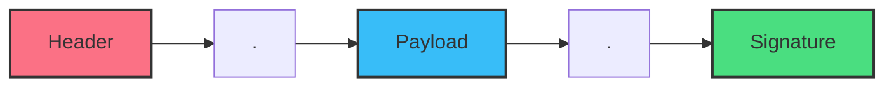
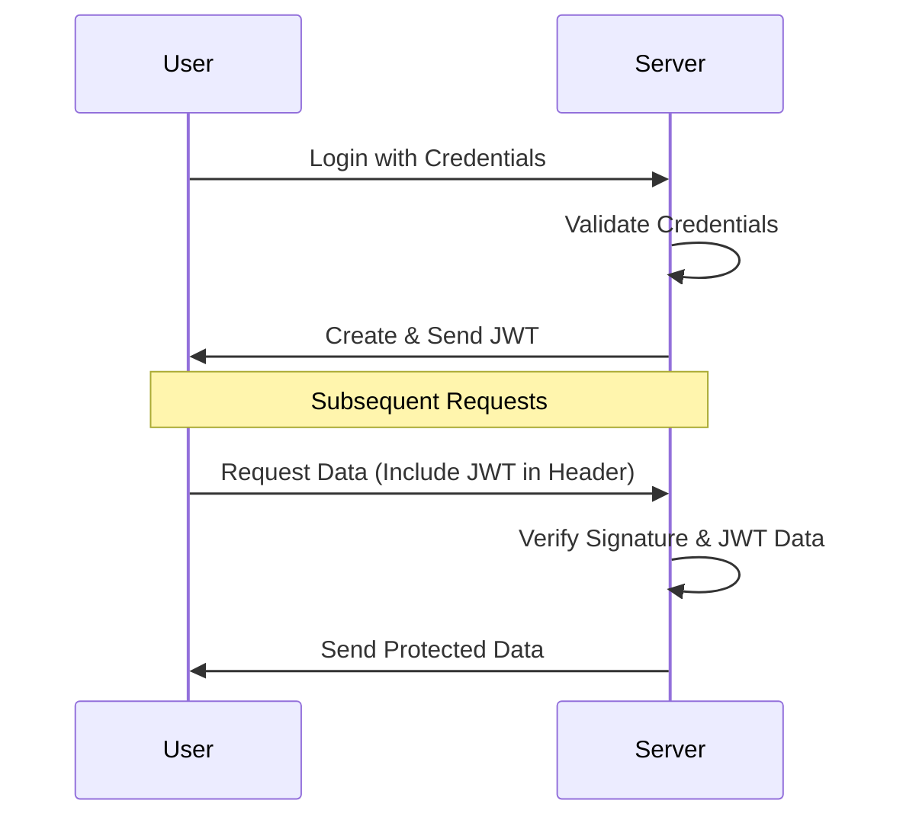

# 🎓 Understanding JSON Web Tokens (JWT)

Welcome to this comprehensive guide on **JSON Web Tokens (JWT)**. This repository is designed to help you teach students the fundamentals of secure information exchange and authorization using JWT.

---

## 🧐 What is JWT?

**JSON Web Token (JWT)** is an open standard ([RFC 7519](https://tools.ietf.org/html/rfc7519)) that defines a compact and self-contained way for securely transmitting information between parties as a JSON object.

### Key Characteristics:
*   **Compact:** Small size allows transmission via URL, POST parameters, or HTTP headers.
*   **Self-contained:** The payload contains all necessary information about the user, avoiding multiple database queries.
*   **Verified & Trusted:** JWTs are digitally signed, ensuring the data hasn't been tampered with.

---

## 🏗️ The Structure of a JWT

A JWT consists of three parts separated by dots (`.`):
`xxxxx.yyyyy.zzzzz`



### 1. Header (Red)
Typically consists of two parts: the type of the token (JWT) and the signing algorithm (like HMAC SHA256 or RSA).
```json
{
  "alg": "HS256",
  "typ": "JWT"
}
```

### 2. Payload (Blue)
Contains the **claims**. Claims are statements about an entity (typically, the user) and additional data.
*   **Registered claims:** Predefined (e.g., `iss` (issuer), `exp` (expiration), `sub` (subject)).
*   **Public claims:** Custom claims shared between parties.
*   **Private claims:** Custom claims used specifically between the server and client.
```json
{
  "sub": "1234567890",
  "name": "John Doe",
  "admin": true,
  "iat": 1516239022
}
```

### 3. Signature (Green)
To create the signature, you take the encoded header, the encoded payload, a secret, and the algorithm specified in the header.
```javascript
HMACSHA256(
  base64UrlEncode(header) + "." +
  base64UrlEncode(payload),
  secret
)
```

---

## 🔄 How JWT Works (The Workflow)

In authentication, when the user successfully logs in, a JSON Web Token will be returned.



### Headers detail:
The client should send the JWT in the `Authorization` header using the **Bearer** schema:
`Authorization: Bearer <token>`

---

## 🛡️ Why Use JWT? (Benefits)

1.  **Stateless.** No need to store session data on the server. Great for scalability!
2.  **Cross-Domain Foundation.** Easy to use across different domains/APIs (Single Sign-On).
3.  **Performance.** Since it's self-contained, it reduces database lookups.
4.  **Security.** Information is signed, so it can't be modified without the secret key.

---

## ⚠️ Important Security Tips for Students

*   **Never put sensitive info in the payload.** JWTs are Base64 encoded, meaning anyone can decode and read the JSON. They are *signed* for integrity (tamper-proofing), not *encrypted* for privacy.
*   **Always use HTTPS.** Protect the token from being intercepted during transmission.
*   **Set an Expiration (`exp`).** Short-lived tokens are safer.
*   **Keep your Secret Key safe!** If someone has your secret, they can forge their own tokens.

---

> [!TIP]
> Use [jwt.io](https://jwt.io) to debug and inspect your tokens during development!

---
*Prepared for students of modern web development.*